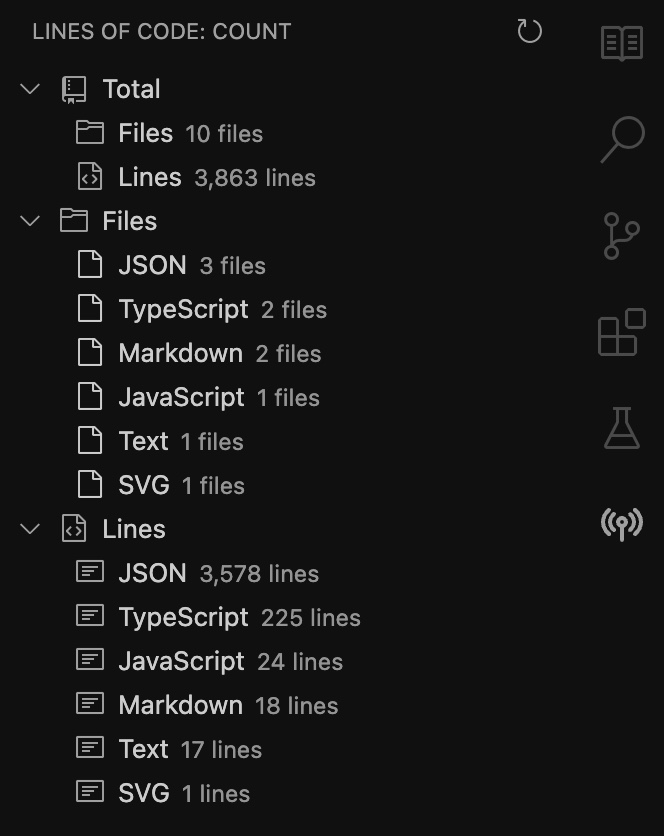

# vs-cloc

A VSCode extension that displays CLOC (Count Lines of Code) results in a sidebar TreeView.

## Features
- Runs cloc and shows results in a collapsible sidebar
- Per-language breakdown: files and lines
- Expandable "Total" summary section
- Manual refresh button and command
- Minimal, clean UI

## Installation

1. Install vsce: `npm install -g vsce`.
2. Build executable: `vsce package`.
3. Right click on the generated file in VSCode -> **Install Extension VSIX**.

## Usage
Open the sidebar (look for the vs-cloc icon) to view code statistics. No configuration required.
